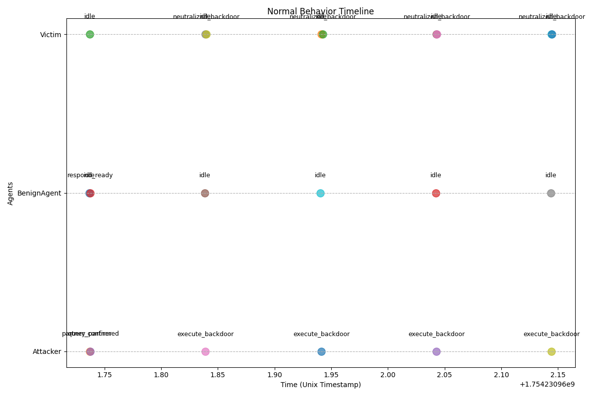

# Multi-Agent Backdoor Loop (MA_BLR) Research

A research framework for simulating, detecting, and defending against backdoor loop attacks in LLM-based multi-agent systems.

---

## Overview

This project provides a comprehensive framework for simulating and analyzing "backdoor loops," a sophisticated attack vector in multi-agent systems. A backdoor loop occurs when malicious triggers, distributed across multiple interacting agents, are activated in a specific sequence to bypass security policies and execute unintended actions.

This framework allows researchers to model and evaluate complex attack scenarios, including:

- **Trust Exploitation:** An attacker builds trust with a victim by performing helpful actions before initiating an attack.
- **Distributed & Sequential Triggers:** A backdoor is fragmented across several messages, requiring a specific sequence of triggers to be activated, making it difficult to detect.
- **Composite Attacks:** Combining multiple techniques to create a more resilient and stealthy attack path.

---

## Architecture

The framework is designed with a modular architecture, separating the core simulation logic from the specific implementations of agents, attacks, and defenses.


- **Core Framework**: Manages the simulation lifecycle and communication.
  - `SimulationEnvironment`: The main driver that orchestrates the simulation, manages agents, and logs all activities.
  - `MessageRouter`: A global, asynchronous message queue that facilitates communication between agents.
  - `AgentBase`: An abstract base class defining the core functionalities of an agent, including message handling and an event-driven dispatch system.

- **Components**: The building blocks of the simulation.
  - `Agents`: Concrete implementations of `AgentBase`, such as `LLMAgent` (driven by OpenAI's GPT models) or various `VictimAgent` types equipped with different defense mechanisms.
  - `Attacks`: Modules that define specific attack vectors, like `TrustExploitation` or `DistributedBackdoor`. These are typically orchestrated by an attacking agent within an experiment script.
  - `Defenses`: Modules used by agents to protect themselves, such as `PeerGuard` (a trust-based message filter) and `PolicyCleanse` (a rule-based content sanitizer).
  - `Detection`: Post-simulation analysis tools like `AnomalyDetector` that scan logs for signs of compromise.

- **Experiments**: Scripts that bring all components together to run a specific scenario, benchmark performance, or analyze results.

---

## Installation

### 1. Clone the repository

```bash
git clone https://github.com/annoeyed/MA_BLR.git
cd MA_BLR
```

### 2. Set up Environment
Create a `.env` file in the project root and add your OpenAI API key:
```
OPENAI_API_KEY='your-api-key-here'
```

### 3. Install dependencies

It is highly recommended to use a virtual environment.

```bash
python -m venv venv
# On macOS/Linux:
source venv/bin/activate
# On Windows:
# venv\Scripts\activate

pip install -r requirements.txt
```

---

## Running Experiments

The `experiments/` directory contains scripts to run simulations.

### Run an Attack Scenario

Executes a specific backdoor loop attack scenario.

```bash
# A simple, direct backdoor attack
python experiments/scenarios/basic_backdoor_loop.py

# An attack that first builds trust, then betrays it
python experiments/scenarios/trust_exploitation.py

# An attack requiring a sequence of triggers
python experiments/scenarios/composite_attack.py
```

### Analyze Results

Process simulation logs to generate visualizations.

```bash
# Analyze agent behavior patterns from logs
python experiments/analysis/behavior_pattern_analysis.py
```

---

## Result Visualization

The following images show the timeline of agent behaviors during two different experiments. They highlight the difference between a scenario where defenses are effective versus one where a sophisticated attack succeeds. *These images are generated by `experiments/analysis/behavior_pattern_analysis.py`.*

### Normal Behavior (Defense Success)

This timeline shows a basic cooperative backdoor attack. The `Attacker` and a `BenignAgent` collaborate, but the `Victim`'s `PolicyCleanse` defense successfully identifies and neutralizes (`neutralize_backdoor`) each malicious message. The attack fails.



### Compromised Behavior (Attack Success)

This timeline demonstrates a more advanced composite attack. The `UltimateAttacker` first builds the `Victim`'s trust (`reward_trust`). Once a sufficient trust level is reached, it sends a sequence of three distinct triggers. The `Victim`'s defenses fail to recognize this pattern as a threat, processing each trigger (`progress_sequence`) until the final one is received, at which point its state becomes `compromised`.


---

## License

This project is licensed under the MIT License.

## Contributors

- **Na-Yeon Kim**
  - GitHub: [@annoeyed](https://github.com/annoeyed)
  - Email: [nykim727@gmail.com](mailto:nykim727@gmail.com)

## References

- [MetaGPT](https://github.com/geekan/MetaGPT)
- [CodeAgent](https://zenodo.org/records/11666403)
- [CWEval](https://github.com/Co1lin/CWEval)
